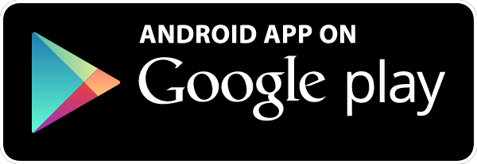
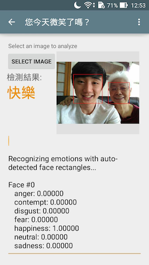

# README

##Overview


「您今天微笑了嗎？」

利用Microsoft cognitive services所新發表的功能Emotion API & Face API，
建立的臉部表情辨識軟體。

共有八種表情可以偵測，分別為：
>"憤怒", "輕蔑", "厭惡", "恐懼", "快樂", "中立", "難過", "驚喜"


[點擊以下載](https://play.google.com/store/apps/details?id=com.dots.focus.smile)
##Demo




##About

DOWNLOAD THE APP NOW!
[https://play.google.com/store/apps/details?id=com.dots.focus.smile](https://play.google.com/store/apps/details?id=com.dots.focus.smile)

原始範例參考自：[https://github.com/Microsoft/ProjectOxford-ClientSDK/tree/master/Emotion/Android](https://github.com/Microsoft/ProjectOxford-ClientSDK/tree/master/Emotion/Android)

本應用程式 "Smile!" 之開放原始碼已部署於Github：
[https://github.com/AdrianHsu/microsoft-emotion-api-android](https://github.com/AdrianHsu/microsoft-emotion-api-android)

＊本應用軟體不會存取您的任何相片＊

##How to

```
git clone https://github.com/AdrianHsu/microsoft-emotion-api-android.git
```


## Microsoft Cognitive Services SDK

Copyright (c) Microsoft Corporation

All rights reserved.


MIT License

Permission is hereby granted, free of charge, to any person obtaining a copy of this software and associated documentation files (the ""Software""), to deal in the Software without restriction, including without limitation the rights to use, copy, modify, merge, publish, distribute, sublicense, and/or sell copies of the Software, and to permit persons to whom the Software is furnished to do so, subject to the following conditions:
The above copyright notice and this permission notice shall be included in all copies or substantial portions of the Software.

THE SOFTWARE IS PROVIDED *AS IS*, WITHOUT WARRANTY OF ANY KIND, EXPRESS OR IMPLIED, INCLUDING BUT NOT LIMITED TO THE WARRANTIES OF MERCHANTABILITY, FITNESS FOR A PARTICULAR PURPOSE AND NONINFRINGEMENT. IN NO EVENT SHALL THE AUTHORS OR COPYRIGHT HOLDERS BE LIABLE FOR ANY CLAIM, DAMAGES OR OTHER LIABILITY, WHETHER IN AN ACTION OF CONTRACT, TORT OR OTHERWISE, ARISING FROM, OUT OF OR IN CONNECTION WITH THE SOFTWARE OR THE USE OR OTHER DEALINGS IN THE SOFTWARE.
